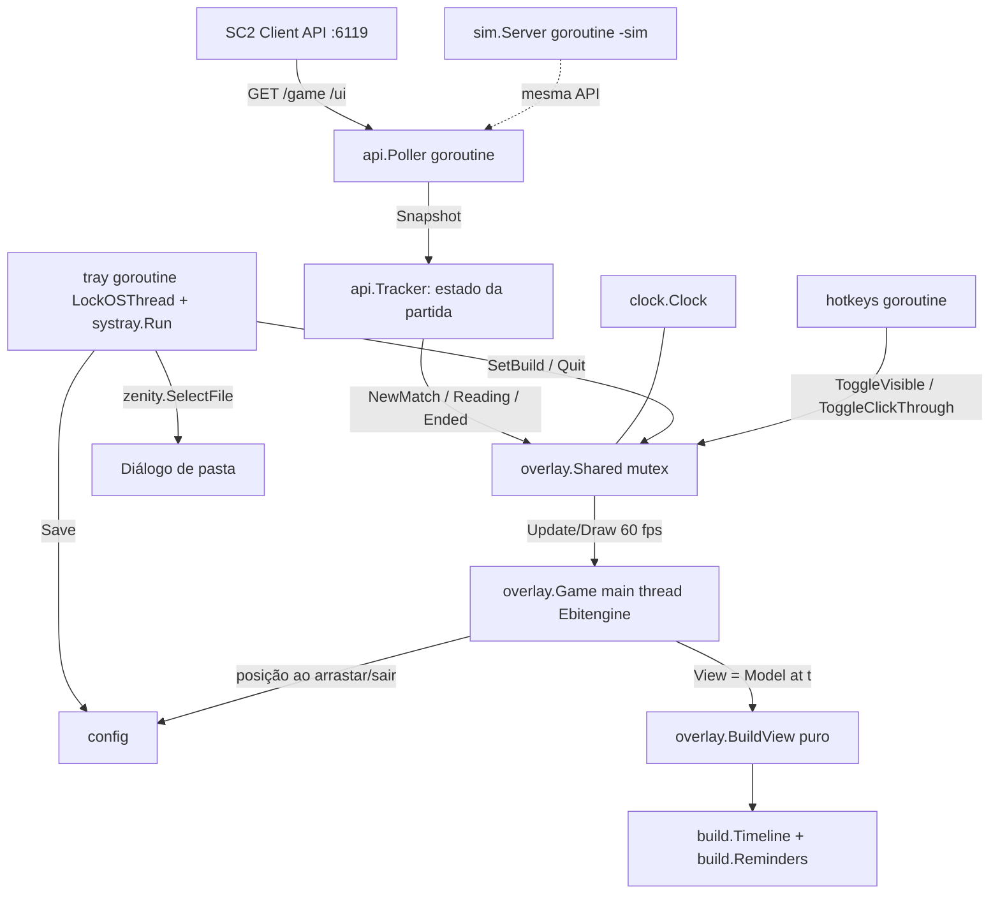

# Overlay: design

**Spec**: `.specs/features/overlay/spec.md`
**Status**: Draft

---

## Architecture Overview

Três threads de SO e algumas goroutines. O Ebitengine fica com a thread principal. A bandeja roda numa goroutine presa à própria thread (`runtime.LockOSThread` + `systray.Run`). Poller, atalhos e simulação são goroutines comuns. Tudo o que a interface lê passa por um único `overlay.Shared` protegido por mutex. A lógica (relógio, timeline, lembretes, modelo de exibição) é pura e testável; o desenho só consome o modelo.



Abordagem única: bibliotecas, threading e pacotes já estão fixados pelo pedido. As alternativas (RunWithExternalLoop, janela Win32 própria) foram descartadas pelo próprio pedido ou pela verificação abaixo.

Verificação feita no código das dependências (module cache):

- `ebiten v2.10.4`: `RunGameOptions.ScreenTransparent`, `SetWindowDecorated`, `SetWindowFloating`, `SetWindowMousePassthrough`, `WindowPosition`, `SetWindowPosition`, `SetWindowSize`, `Monitor().Size()` existem.
- `fyne.io/systray v1.12.2`: `init()` faz `runtime.LockOSThread()` na main goroutine (não conflita com o Ebitengine, que também quer a main). `Run` = `Register` + `nativeLoop` na mesma goroutine. `RunWithExternalLoop` → `nativeStart` roda o loop em `go func()`, outra thread: confirma o alerta do pedido. `MenuItem.Remove()` existe (usado para recarregar o submenu). `Quit` envia `WM_CLOSE`.
- `golang.design/x/hotkey v0.6.3` (Windows): cada atalho tem uma goroutine com `LockOSThread` e `RegisterHotKey(0, …)` num loop de `PeekMessage`. Sem `mainthread` no Windows. Não precisa de administrador (a menos que o SC2 rode como administrador; o UIPI bloqueia atalhos para janelas elevadas: documentar).

---

## Code Reuse Analysis

### Existing Components to Leverage

| Component | Location | How to Use |
| --------- | -------- | ---------- |
| Repositório vazio | - | Nada a reaproveitar. |
| Go fonts | `golang.org/x/image/font/gofont/goregular`, `gobold` | Bytes TTF para `text/v2.NewGoTextFaceSource`. Já é dependência do Ebitengine. |
| `akavel/rsrc` | já no go.mod (via zenity) | Gerar `rsrc_windows_amd64.syso` com o ícone do `.exe`. |
| `ebiten/v2/audio` | Ebitengine | Bipe PCM gerado em código (sem arquivo). |

### Integration Points

| System | Integration Method |
| ------ | ------------------ |
| SC2 Client API | HTTP GET `localhost:6119/game` e `/ui`, JSON, timeout 400 ms |
| Windows tray / diálogo | `fyne.io/systray`, `ncruces/zenity` |
| Atalhos | `golang.design/x/hotkey` |
| Disco | `%APPDATA%\SC2BuildOverlay\{config.yml, overlay.log, builds\}` |

---

## Components

Módulo `sc2overlay`, pacotes em `internal/`. `main.go` na raiz só junta tudo.

### build

- **Purpose**: Formato da build, carregamento, timeline de passos, lembretes e catálogo da pasta.
- **Location**: `internal/build/`
- **Interfaces**:
  - `ParseTime(s string) (int, error)` e `FormatTime(sec int) string` (`m:ss`).
  - `Load(path string) (*Build, error)`; `Parse(data []byte, fileName string) (*Build, error)`.
  - `NewTimeline(b *Build) *Timeline`; `(*Timeline).At(t float64, warn int) Status` → estado de cada grupo, índice atual, contagem, `Done`.
  - `ReminderStatus(rs []Reminder, t float64) []ReminderState` → ativos, contagem, `Flash`.
  - `Scan(dir string) []Entry` → arquivos `.yml`/`.yaml` ordenados, com `Name`, `Build` ou `Err`.
  - `Suggest(entries []Entry, myRace, oppRace string) (file string, ok bool)`.
- **Dependencies**: `gopkg.in/yaml.v3`.

### clock

- **Purpose**: Relógio da partida interpolado e ressincronizado.
- **Location**: `internal/clock/clock.go`
- **Interfaces**:
  - `New(now func() time.Time) *Clock`
  - `(*Clock).Observe(displayTime float64)` – nova leitura.
  - `(*Clock).Reset()` – partida nova / fora de partida.
  - `(*Clock).Now() float64` – tempo exibido (monotônico, CLK-01).
- **Dependencies**: nenhuma. Seguro para concorrência (mutex interno).

### api

- **Purpose**: Cliente da SC2 API, máquina de estados da partida e loop de consulta.
- **Location**: `internal/api/`
- **Interfaces**:
  - `Client{BaseURL, HTTP}`; `(*Client).Game(ctx) (Game, error)`; `(*Client).UI(ctx) (UI, error)`.
  - `Tracker.Update(ok bool, g Game, ui UI) Event` – eventos `None`, `Online`, `Offline`, `MatchStart`, `Reading`, `MatchEnd`.
  - `Run(ctx, client, interval, showReplays func() bool, sink func(Event, Game))` – o poller.
- **Dependencies**: `net/http`, `encoding/json`.

### sim

- **Purpose**: Servidor falso da API com ciclo menu → carregamento → partida.
- **Location**: `internal/sim/sim.go`
- **Interfaces**: `New(now func() time.Time, speed float64, length time.Duration) *Sim`; `Handler() http.Handler`; `Pause()`, `Resume()`, `SetSpeed(f)`, `NewMatch()`; `ListenAndServe(ctx, addr) error`.

### config

- **Purpose**: Carregar/salvar `config.yml`, primeira execução, caminhos.
- **Location**: `internal/config/config.go`
- **Interfaces**: `Dir() string`; `Load(dir string) (Config, error)`; `Save(dir string, c Config) error` (atômico); `EnsureFirstRun(dir string, example []byte) (Config, error)`.

### hotkeys

- **Purpose**: Parser de `Ctrl+Alt+H` e registro dos dois atalhos.
- **Location**: `internal/hotkeys/`
- **Interfaces**: `Parse(s string) ([]hotkey.Modifier, hotkey.Key, error)`; `Listen(ctx, spec string, fn func()) error`.

### overlay

- **Purpose**: Estado compartilhado, modelo de exibição e o `ebiten.Game`.
- **Location**: `internal/overlay/`
- **Interfaces**:
  - `Shared` (mutex): `SetBuild(*build.Build, name string)`, `SetStatus(Status)`, `ToggleVisible()`, `ToggleClickThrough()`, `RequestQuit()`, `Snapshot() SharedSnapshot`.
  - `BuildView(in ViewInput) View` – puro: linhas (texto, cor, riscado, nota), cabeçalho, linha de lembretes, altura total, deslocamento de rolagem.
  - `Game` – `Update` (arraste, roda do mouse, passthrough, `ebiten.Termination`), `Draw`, `Layout`.
- **Dependencies**: `build`, `clock`, Ebitengine, `text/v2`, gofont.

### tray

- **Purpose**: Ícone, menu, submenu de builds, diálogo de pasta, submenu de simulação.
- **Location**: `internal/tray/tray.go`
- **Interfaces**: `Start(opts Options)` (goroutine própria com `LockOSThread` + `systray.Run`); `Options` traz callbacks `OnSelect(file)`, `OnFolder(dir)`, `OnQuit()`, `Entries() []build.Entry`, `Sim *sim.Sim` opcional; `Refresh()` reconstrói o submenu.

### assets

- **Purpose**: Ícone embutido (`//go:embed icon.ico icon.png`) e a build de exemplo (`//go:embed example.yml`).
- **Location**: `assets/`

---

## Data Models

```go
type Build struct {
    Name      string     `yaml:"name"`
    Race      string     `yaml:"race"`
    Vs        string     `yaml:"vs"`
    Steps     []Step     `yaml:"steps"`
    Reminders []Reminder `yaml:"reminders"`
    File      string     `yaml:"-"`
}
type Step struct {
    TimeText string `yaml:"time"`
    Action   string `yaml:"action"`
    Note     string `yaml:"note"`
    Time     int    `yaml:"-"` // segundos
}
type Reminder struct {
    Text         string `yaml:"text"`
    EverySeconds int    `yaml:"every_seconds"`
    UntilText    string `yaml:"until"`
    Until        int    `yaml:"-"`
}

type Config struct {
    BuildsFolder   string    `yaml:"builds_folder"`
    SelectedBuild  string    `yaml:"selected_build"` // nome do arquivo
    Hotkeys        Hotkeys   `yaml:"hotkeys"`        // toggle_visible, toggle_click_through
    Opacity        float64   `yaml:"opacity"`
    WindowPosition *Position `yaml:"window_position"`
    WarningSeconds int       `yaml:"warning_seconds"`
    Sound          bool      `yaml:"sound"`
    ShowReplays    bool      `yaml:"show_replays"`
    PlayerName     string    `yaml:"player_name"`
}

type Game struct {
    IsReplay    bool     `json:"isReplay"`
    DisplayTime float64  `json:"displayTime"`
    Players     []Player `json:"players"`
}
type Player struct {
    ID     int    `json:"id"`
    Name   string `json:"name"`
    Type   string `json:"type"`
    Race   string `json:"race"`
    Result string `json:"result"`
}
type UI struct {
    ActiveScreens []string `json:"activeScreens"`
}
```

Sequência de estados do tracker: `Offline` → `OutOfMatch` ⇄ `InMatch`. Transição para `InMatch` emite `MatchStart`; queda de `displayTime` > 2 s dentro de `InMatch` também emite `MatchStart`.

---

## Error Handling Strategy

| Error Scenario | Handling | User Impact |
| -------------- | -------- | ----------- |
| API fora do ar | Tracker vai para `Offline`; log só na transição | "Aguardando partida…" |
| JSON inesperado | Tratado como falha da consulta | Idem |
| Build inválida | `Entry.Err`, log com motivo | "(erro)" no submenu |
| Config malformado | Padrões na memória, log, não sobrescreve | Overlay abre com padrões |
| Atalho inválido/ocupado | Log, segue sem ele | Atalho não funciona |
| Porta 6119 ocupada no `-sim` | Log + status | "Porta 6119 ocupada (jogo aberto?)" |
| Diálogo cancelado | `zenity.ErrCanceled` ignorado | Nada muda |
| Pânico numa goroutine de fundo | `recover` + log no poller e na bandeja | App segue |

---

## Risks & Concerns

| Concern | Location (file:line) | Impact | Mitigation |
| ------- | -------------------- | ------ | ---------- |
| Formato real da API não verificado | `internal/api/client.go` (novo) | Detecção de partida errada | Decodificação tolerante (campos opcionais); verificação com o jogo na etapa 4 (T25). |
| Bandeja + Ebitengine na mesma app | `internal/tray/tray.go` (novo) | Cliques no menu não chegam | Prova de conceito na etapa 2 (T8) antes do resto. |
| Transparência/passthrough sobre o SC2 | `internal/overlay/game.go` (novo) | Janela opaca ou rouba cliques | Testado no POC; aviso de tela cheia exclusiva no README. |
| `--version` com `-H windowsgui` não tem console | `main.go` (novo) | Nada é impresso | `AttachConsole(ATTACH_PARENT_PROCESS)` via `golang.org/x/sys/windows`. |
| SC2 rodando como administrador | `internal/hotkeys` | Atalhos não disparam dentro do jogo | Documentar no README: rodar o overlay com o mesmo nível do jogo. |
| Testes de UI/bandeja não são automáticos | `internal/tray`, `internal/overlay/game.go` | Regressões visuais | Lógica movida para `BuildView` (testado); smoke manual com print por etapa. |

---

## Tech Decisions

| Decision | Choice | Rationale |
| -------- | ------ | --------- |
| Onde ficam as regras de exibição | `overlay.BuildView` puro, `Draw` burro | Testável sem janela. |
| Esconder | Não desenhar + passthrough | Ebitengine não tem "ocultar"; estável. |
| Fonte | gofont (Go Regular/Bold) | Sem arquivo extra; acentos ok; licença BSD. |
| Ícone | Gerado em código (`cmd/genicon`), commitado como `.ico/.png/.syso` | Sem ferramenta externa; reproduzível. |
| Recarga da pasta | Varredura a cada 2 s por data de modificação | Sem dependência nova (fsnotify). |
| Seletor de pasta | Roda num processo filho (`overlay.exe -choose-folder <pasta>`), que imprime a pasta escolhida | O diálogo nativo carrega extensões do shell no processo. Sair com ele aberto travou o encerramento do processo (zumbi que prende o `.exe`). `zenity.Context` não fecha o `IFileDialog` na v0.10.15 (testado: 20 s sem fechar). No processo filho, "Sair" mata o helper e o overlay fecha em ~1 s. |
| Log | `log` padrão para `%APPDATA%\SC2BuildOverlay\overlay.log`, truncado ao passar de 1 MB na abertura | Simples. |
